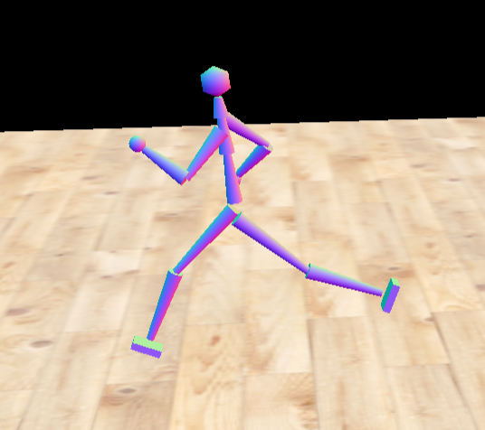
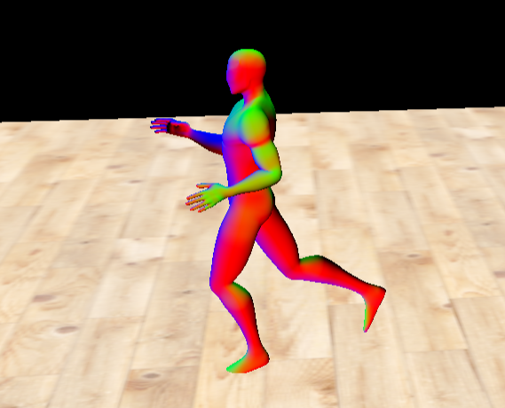
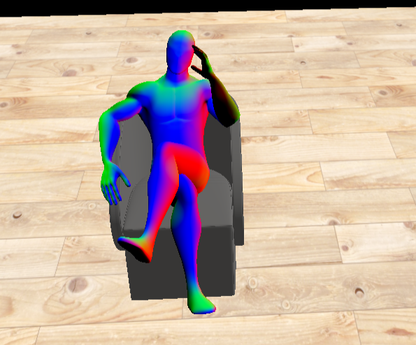

<table>
  <tr>
    <td>
      
    </td>
    <td>
      
    </td>
  </tr>
  <tr>
    <td>
      
    </td>
    <td>
      
    </td>
  </tr>
</table>

## Description de la tâche à réaliser
Ce second travail pratique a pour objectif de manipuler les transformations géométriques en 3D à l’aide de rotations, 
translations et changements d’échelle, tout en appliquant ces transformations à un modèle de robot créé à partir de 
primitives. Sans utiliser les fonctions intégrées de Three.js, il faut construire manuellement les matrices de 
transformation en JavaScript et animer le robot à l’aide de la fonction updateBody. Le projet comprend la création 
et l’animation des membres du robot, l’ajout de différentes poses accessibles par le clavier, ainsi que l’intégration 
d’un maillage animé par Linear Blend Skinning dans les shaders. Une partie créative permet enfin d’ajouter de nouveaux 
effets ou objets à la scène pour enrichir l’animation et démontrer une compréhension approfondie des transformations 3D.

## Informations sur l'implémentation

Pour ma pose de repos, je n'ai pas utilisé les rotations définies dans le constructor mais j'ai plutôt défini des rotations pour avoir une T-pose, ce qui selon moi me facilitait le travail dans la suite.

Pour la question 2, j'ai choisi l'option d'ajouter de nouveaux éléments à la scène pour faire intérargir le robot avec. Le premier ajouté est un plateau de pierre que le robot dans la pose 1 s'apprête à casser. Et le deuxième élément est un fauteuil 3D dans lequel le robot s'assied à la pose 2.
Pour le plateau en pierre, j'ai utilisé une simple BoxGeometry avec une texture de pierre. Pour le fauteuil j'ai ajouté un élément .dae et je lui ai appliqué une texture. Je me suis principalement inspiré du code déjà fourni et de cette source https://discourse.threejs.org/t/how-can-i-use-three-js-materials-on-loaded-models/18146.